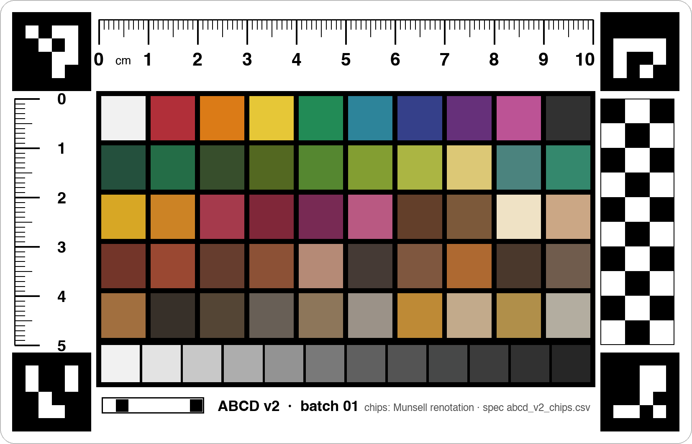

# ABCD v2 calibration card

A larger AstroBotany calibration card (140 × 90 mm) whose 62 colour chips are defined by **Munsell notation** and
chosen to correspond to plant-tissue and soil colours, with **standard ArUco corner markers** so software can tell it
apart from the original card.

**Site (for discussion):** https://dr-richard-barker.github.io/ABCD_v2/ ·
**Slides:** [presentation/ABCD_v2_deck.pdf](presentation/ABCD_v2_deck.pdf) ·
**Open questions:** [issues labelled `discussion`](https://github.com/dr-richard-barker/ABCD_v2/issues?q=is%3Aissue+label%3Adiscussion)



> **Status: design proposal.** Not yet printed or measured. The chip values are print *targets*; each print batch
> must be measured before its values are used for colour correction (see [Printing and measuring](#printing-and-measuring)).

## What's in the repo

| Path | What it is |
|---|---|
| `card/abcd_v2_print.pdf` | Print file: 146 × 96 mm page = **140 × 90 mm trim + 3 mm bleed**, sRGB |
| `card/abcd_v2.svg`, `card/abcd_v2_preview.png` | Vector master (mm units) and 300 dpi preview |
| `card/abcd_v2_chips.csv` / `.json` | Chip spec: Munsell notation, xyY, Lab D50, sRGB, CMYK guide, gamut ΔE, position on card; the JSON also holds the layout geometry and marker IDs |
| `measurements/batch_template.csv` | Template for spectrophotometer readings of a print batch (never overwritten by the scripts) |
| `scripts/make_abcd_v2.py` | Generates the card and spec; `--ts-out` writes the chip table for the calibration app; `--measured` swaps in measured values |
| `scripts/run_all.sh` | Rebuilds the card and regenerates every file in `results/` |
| `scripts/make_figures.py`, `scripts/build_site.py` | Figures, the Pages site data, and the deck PDF |
| `verify/` | OpenCV ArUco check, v1 geometry measurement, Munsell cross-check, and the detector test harness |
| `results/` | Generated evidence quoted by the site and deck |
| `figures/` | Card anatomy and v1 / v1.5 / v2 to-scale comparison |
| `docs/` | GitHub Pages site (`index.html`) and the HTML deck (`deck.html`) |
| `reference/` | v1 StickerMule artwork and the v1.5 draft |

## The card

- **Corner markers:** OpenCV ArUco `DICT_4X4_50` IDs **0, 1, 2, 3** (TL, TR, BR, BL), 16 mm. The original v1 card's
  corners are IDs 46–49 (BL 46, TL 47, TR 48, BR 49), so any ArUco reader can tell which card is in a photo and
  which way up it is. `verify/check_aruco_ids.py` confirms each marker against OpenCV and reads both cards with
  OpenCV's own detector.
- **Rulers:** 0–10 cm across and 0–5 cm down, to check that x and y scale agree. **Checker:** 5 mm squares.
- **Chips:** 9 × 9 mm on a black surround.
  - Row A: calibration (white, black, eight hues around the colour circle).
  - Rows B–C: plant tissue.
  - Rows D–E: soil.
  - A 12-step neutral ramp N9.5 → N1.5.
- **Version/batch code:** 8 cells (3-bit version + 5-bit batch).

### Where the chip colours come from

- **Soil (D–E):** 20 chips that exist on the six hue pages of the Munsell Soil-Color Charts
  ([soils.uga.edu scan](https://soils.uga.edu/files/2016/08/Munsell.pdf): 10R, 2.5YR, 5YR, 7.5YR, 10YR, 2.5Y), each
  labelled with the colour name printed on its page. No chip claims to match a specific regolith simulant or Apollo sample.
- **Plant tissue (B–C):** every hue is one of the 17 pages of the Munsell Plant Tissue Color Book
  ([vendor listing](https://modeinfo.com/By-manufacturer/Munsell-Color/Munsell-Plant-Tissue-Color-Book-Scientific-Plant-Colour-Reference-Charts.html)).
  The value/chroma are **design targets**, not yet checked against that book's printed chips.
- **Conversion:**
  1. The notation goes through the Munsell renotation data (`colour-science`, Illuminant C) to give xyY.
  2. A Bradford adaptation gives **Lab D50** (print/measurement target) and **sRGB** (file colour).
  3. **Gamut gate:** a chip must survive a round trip through a CMYK press profile (ΔE2000 ≤ 3) *and* fit sRGB.
     Otherwise its chroma steps down by 2 on the same hue page. Swaps are logged in `results/generator_log.txt`.
- The scanned PDF's pixel colours were **not** used. It's a photograph, so its colours depend on the scanner.
- **Cross-check:** `verify/crosscheck_werth.py` compares our sRGB values with Andrew Werth's
  [Virtual Munsell Color Wheel](https://www.andrewwerth.com/aboutmunsell/). It's built from the same renotation data,
  so this checks the conversion, not the data. Result in `results/werth_crosscheck.txt`.

## Detection in the calibration app

The [calibration app](https://github.com/dr-richard-barker/AstroBotany_calibration_image_sharing_and_analysis)
reads the card through `src/lib/colorcalib.ts`. `scripts/run_all.sh` runs that detector on synthetic photos of both
cards (flat, tilted, rotated, upside down; each also with a colour cast, noise and blur). Results are in
`results/detection_before.txt` (app as committed) and `results/detection_after.txt` (with marker-ID checking). The
site's [Detection tests](https://dr-richard-barker.github.io/ABCD_v2/#tests) section tabulates them.

What the fix does: corners are accepted only if their ArUco ID matches one of the two cards. The IDs then give the
corner order and the card version, which selects the matching spans, chip layout and reference colours.

> The app-side change lives in the calibration app's repository. Until it is merged there,
> `results/detection_after.txt` records that it was run against an uncommitted working tree.

**Also found:** `verify/measure_v1_geometry.py` measures the v1 artwork against its own printed ruler. Its markers
come out 4.56 cm apart across and 3.69 cm down, while the app assumes 4.3 cm for both. If the printed sticker matches
the artwork, v1 lengths are reported ~4% long. This needs confirming on real v1 photos before the app is changed
(`results/v1_geometry.txt`).

## Printing and measuring

1. Print matte if possible: glare hides markers and chips.
2. Measure **≥ 3 stickers per batch**, every chip, with a spectrophotometer at **D50 / 2°** (M1 if available). Record
   L\*, a\*, b\* in a copy of `measurements/batch_template.csv`.
3. Flag chips whose sticker-to-sticker ΔE2000 exceeds 2.
4. Regenerate the app's chip table from the measurements:
   `python scripts/make_abcd_v2.py --batch N --measured measurements/batch_N.csv --ts-out <app>/src/lib/abcd_v2_chips.ts`
5. Give each print run its own `--batch` number; it is printed in the card's code.

## Rebuild everything

```bash
pip install -r requirements.txt
```

```bash
PY=python3 APP=../AstroBotany_calibration_image_sharing_and_analysis sh scripts/run_all.sh
```

```bash
python3 scripts/make_figures.py
```

```bash
python3 scripts/build_site.py
```

The detection step needs a checkout of the calibration app with `node_modules` installed. `build_site.py` prints the
deck with headless Google Chrome if it is installed.

## Licence and citation

Code: [MIT](LICENSE). Card artwork, chip specification and documentation: [CC BY 4.0](LICENSE-CC-BY-4.0.txt).
The v1 artwork in `reference/` is included for comparison. Cite via [CITATION.cff](CITATION.cff).
